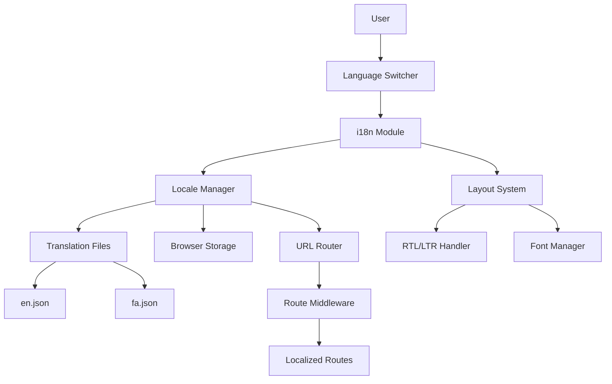

# Design Document: Bilingual i18n Support

## Overview

This design implements comprehensive bilingual support for the Shanbe Global Nuxt application, enabling seamless switching between English and Persian (Farsi) languages. The implementation leverages the @nuxtjs/i18n module to provide localized content, RTL layout support, Persian typography, and URL-based locale detection.

The design follows Nuxt 3 best practices and integrates with the existing UI components and layout structure. Key features include automatic text direction switching, locale persistence, and a user-friendly language switcher component.

## Architecture

### High-Level Architecture



### Component Interaction Flow

1. **User Interaction**: User clicks the Language Switcher component
2. **Locale Change**: i18n module updates the active locale
3. **Storage Update**: New locale preference is saved to localStorage
4. **URL Update**: Router navigates to the localized URL (with or without /fa prefix)
5. **Layout Update**: HTML dir attribute is updated (ltr/rtl)
6. **Font Update**: CSS applies the appropriate font family
7. **Content Update**: All $t() calls re-evaluate and display translated text

### Module Integration

The @nuxtjs/i18n module integrates with Nuxt 3's module system and provides:
- Automatic route generation with locale prefixes
- Composables for accessing locale state ($t, $i18n, useI18n)
- Head management for lang and dir attributes
- Cookie/localStorage-based locale persistence
- SEO-friendly alternate link generation

## Components and Interfaces

### 1. i18n Configuration (nuxt.config.ts)

**Purpose**: Configure the i18n module with locale definitions and behavior settings.

**Configuration Structure**:
```typescript
{
  modules: ['@nuxtjs/i18n'],
  i18n: {
    locales: [
      {
        code: 'en',
        name: 'English',
        dir: 'ltr',
        file: 'en.json'
      },
      {
        code: 'fa',
        name: 'فارسی',
        dir: 'rtl',
        file: 'fa.json'
      }
    ],
    defaultLocale: 'en',
    strategy: 'prefix_except_default',
    langDir: 'locales/',
    detectBrowserLanguage: {
      useCookie: true,
      cookieKey: 'i18n_redirected',
      redirectOn: 'root'
    }
  }
}
```

**Key Properties**:
- `strategy: 'prefix_except_default'`: English URLs have no prefix, Persian URLs use /fa
- `detectBrowserLanguage`: Enables automatic locale detection and persistence
- `langDir`: Points to the locales directory containing translation files

### 2. Translation Files

**Purpose**: Store all translatable text in structured JSON format.

**File Structure**:
```
locales/
├── en.json
└── fa.json
```

**Translation Schema**:
```typescript
interface TranslationFile {
  sidebar: {
    dashboard: string;
    agents: string;
    about: string;
    contact: string;
  };
  general: {
    search_placeholder: string;
    connect: string;
  };
}
```

**English Translations (en.json)**:
```json
{
  "sidebar": {
    "dashboard": "Market Pulse",
    "agents": "Agent Store",
    "about": "About Shanbe",
    "contact": "Contact Bridge"
  },
  "general": {
    "search_placeholder": "Find an expert...",
    "connect": "Connect"
  }
}
```

**Persian Translations (fa.json)**:
```json
{
  "sidebar": {
    "dashboard": "نبض بازار",
    "agents": "بازار هوشمند",
    "about": "درباره شنبه",
    "contact": "پل ارتباطی"
  },
  "general": {
    "search_placeholder": "جستجوی متخصص...",
    "connect": "اتصال"
  }
}
```

### 3. LanguageSwitcher Component

**Purpose**: Provide a UI control for users to switch between English and Persian.

**Component Interface**:
```vue
<template>
  <button @click="toggleLocale" class="language-switcher">
    <span class="flag">{{ currentFlag }}</span>
    <span class="locale-code">{{ currentLocale.toUpperCase() }}</span>
  </button>
</template>

<script setup>
const { locale, locales, setLocale } = useI18n()

const currentLocale = computed(() => locale.value)
const alternateLocale = computed(() => 
  locale.value === 'en' ? 'fa' : 'en'
)

const currentFlag = computed(() => 
  locale.value === 'en' ? '🇬🇧' : '🇮🇷'
)

const toggleLocale = () => {
  const newLocale = alternateLocale.value
  setLocale(newLocale)
}
</script>
```

**Styling Requirements**:
- Clean, minimal button design with flag icon
- Positioned in the header/navigation area for easy visibility
- Flag icons: 🇬🇧 for English, 🇮🇷 for Persian/Iran
- Consistent with the application's design system
- Clear visual indication of current locale with flag and text

### 4. Layout Updates (layouts/default.vue)

**Purpose**: Integrate i18n functionality into the main layout, replace hardcoded text, and integrate the LanguageSwitcher into the header.

**Key Changes**:

1. **Dynamic HTML Attributes**:
```vue
<script setup>
const { locale, locales } = useI18n()

const localeProperties = computed(() => 
  locales.value.find(l => l.code === locale.value)
)

useHead({
  htmlAttrs: {
    lang: locale.value,
    dir: localeProperties.value?.dir || 'ltr'
  }
})
</script>
```

2. **Translated Menu Items**:
```vue
const menuItems = [
  {
    label: 'sidebar.dashboard',
    icon: 'i-lucide-bar-chart-3',
    path: '/'
  },
  {
    label: 'sidebar.agents',
    icon: 'i-lucide-bot',
    path: '/agents'
  },
  {
    label: 'sidebar.about',
    icon: 'i-lucide-building-2',
    path: '/about'
  },
  {
    label: 'sidebar.contact',
    icon: 'i-lucide-phone',
    path: '/contact'
  }
]
```

3. **Template Usage**:
```vue
<template>
  <NuxtLink>
    <span>{{ $t(item.label) }}</span>
  </NuxtLink>
</template>
```

4. **Header Integration**:
```vue
<template>
  <header class="header">
    <!-- Other header content -->
    <LanguageSwitcher />
  </header>
</template>
```

The LanguageSwitcher component should be positioned in the header area where users can easily see and access it, providing immediate visibility for language selection.

### 5. App Root Updates (app.vue)

**Purpose**: Configure global head management for i18n support.

**Updates**:
```vue
<script setup>
const { locale, locales } = useI18n()

const localeProperties = computed(() => 
  locales.value.find(l => l.code === locale.value)
)

useHead({
  htmlAttrs: {
    lang: locale.value,
    dir: localeProperties.value?.dir || 'ltr'
  },
  link: [
    {
      rel: 'stylesheet',
      href: 'https://cdn.jsdelivr.net/npm/vazirmatn@33.0.3/Vazirmatn-font-face.css',
      media: locale.value === 'fa' ? 'all' : 'not all'
    }
  ]
})
</script>
```

### 6. RTL Styling System

**Purpose**: Ensure proper layout and text alignment for RTL languages.

**CSS Strategy**:
```css
/* Automatic text alignment based on dir attribute */
[dir="rtl"] {
  text-align: right;
}

[dir="ltr"] {
  text-align: left;
}

/* Persian font application */
[dir="rtl"] * {
  font-family: 'Vazirmatn', sans-serif;
}

/* Preserve specific component positioning */
[dir="rtl"] .sidebar {
  /* Sidebar stays on left regardless of direction */
}

/* Flip flex directions for RTL */
[dir="rtl"] .flex-row {
  flex-direction: row-reverse;
}
```

**Tailwind RTL Support**:
Nuxt UI and Tailwind CSS automatically handle RTL transformations for:
- Padding and margin (pl becomes pr in RTL)
- Text alignment
- Flex direction
- Border radius

## Data Models

### Locale Configuration Model

```typescript
interface LocaleConfig {
  code: string;           // 'en' or 'fa'
  name: string;           // 'English' or 'فارسی'
  dir: 'ltr' | 'rtl';    // Text direction
  file: string;           // Translation file name
}
```

### Translation Key Model

```typescript
interface TranslationKeys {
  sidebar: {
    dashboard: string;
    agents: string;
    about: string;
    contact: string;
  };
  general: {
    search_placeholder: string;
    connect: string;
  };
}
```

### i18n State Model

```typescript
interface I18nState {
  locale: string;                    // Current active locale
  locales: LocaleConfig[];           // Available locales
  messages: Record<string, any>;     // Loaded translations
  fallbackLocale: string;            // Fallback when translation missing
}
```

### Browser Storage Model

```typescript
interface LocalePreference {
  locale: string;        // User's preferred locale
  timestamp: number;     // When preference was set
}
```

The locale preference is stored in localStorage with the key `i18n_redirected` (managed automatically by @nuxtjs/i18n).


## Correctness Properties

*A property is a characteristic or behavior that should hold true across all valid executions of a system—essentially, a formal statement about what the system should do. Properties serve as the bridge between human-readable specifications and machine-verifiable correctness guarantees.*

### Property 1: URL Locale Prefix Consistency

*For any* route path, when the active locale is the default locale ('en'), the generated URL should not contain a locale prefix, and when the active locale is non-default ('fa'), the generated URL should contain the '/fa' prefix.

**Validates: Requirements 1.6, 1.7, 8.1, 8.2**

### Property 2: Locale Toggle Behavior

*For any* current locale state, clicking the language switcher should toggle the locale to the alternate locale (en ↔ fa).

**Validates: Requirements 3.3**

### Property 3: Dynamic Dir Attribute Synchronization

*For any* locale change, the HTML dir attribute should immediately update to match the new locale's text direction ('ltr' for English, 'rtl' for Persian).

**Validates: Requirements 4.1, 4.2, 4.3**

### Property 4: Missing Translation Key Fallback

*For any* translation key that does not exist in the current locale's translation file, the $t() function should return the key itself as a fallback value.

**Validates: Requirements 6.4**

### Property 5: Translation Reactivity

*For any* locale change, all displayed translated text (via $t() calls) should immediately update to show the translations from the new locale without requiring a page reload.

**Validates: Requirements 6.7**

### Property 6: Locale Preference Persistence

*For any* locale selection by the user, the system should store the selected locale in browser storage (localStorage or cookie).

**Validates: Requirements 7.1**

### Property 7: Locale Preference Restoration Round-Trip

*For any* locale preference stored in browser storage, when the application is reloaded or revisited, the system should restore and activate that stored locale.

**Validates: Requirements 7.2**

### Property 8: URL-Based Locale Activation

*For any* URL containing a valid locale prefix (e.g., '/fa/agents'), navigating to that URL should activate the corresponding locale.

**Validates: Requirements 8.3**

### Property 9: URL Preservation During Locale Switch

*For any* URL containing query parameters or hash fragments, switching locales should preserve those query parameters and hash fragments in the new localized URL.

**Validates: Requirements 8.4**

### Property 10: Route Equivalence on Locale Switch

*For any* route path, switching locales should navigate to the equivalent route in the new locale (e.g., '/agents' → '/fa/agents' or '/fa/about' → '/about').

**Validates: Requirements 8.5**

### Property 11: Localized Link Generation

*For any* route path used in a NuxtLink component, the generated href should include the appropriate locale prefix based on the current active locale.

**Validates: Requirements 8.6**

## Error Handling

### Translation Key Errors

**Scenario**: A translation key is referenced but doesn't exist in the translation file.

**Handling**:
- The $t() function returns the key itself as a string
- No runtime error is thrown
- In development mode, a console warning may be logged
- The application continues to function normally

**Example**:
```javascript
$t('sidebar.nonexistent') // Returns: 'sidebar.nonexistent'
```

### Locale File Loading Errors

**Scenario**: A translation file (en.json or fa.json) fails to load or contains invalid JSON.

**Handling**:
- The i18n module logs an error to the console
- Falls back to the default locale's translations
- If default locale also fails, displays translation keys as fallback
- Application remains functional with degraded localization

### Invalid Locale Code

**Scenario**: User attempts to set a locale that isn't configured (e.g., 'de' for German).

**Handling**:
- The setLocale() function ignores the invalid locale
- Current locale remains unchanged
- Console warning is logged in development mode
- No navigation or state change occurs

### Browser Storage Unavailable

**Scenario**: localStorage is disabled or unavailable (private browsing, browser restrictions).

**Handling**:
- Locale preference is not persisted
- Application falls back to browser language detection
- If detection fails, uses default locale ('en')
- Locale changes still work within the current session
- No error is shown to the user

### Font Loading Failure

**Scenario**: The Vazirmatn font CDN is unavailable or fails to load.

**Handling**:
- CSS falls back to the sans-serif system font
- Persian text remains readable but may not be optimally styled
- No error is displayed to the user
- Application functionality is unaffected

### RTL Layout Issues

**Scenario**: Custom CSS or third-party components don't properly support RTL.

**Handling**:
- Core application layout uses tested RTL-compatible patterns
- Document known third-party component limitations
- Provide CSS overrides for specific RTL issues
- Test all major UI components in both LTR and RTL modes

## Testing Strategy

### Dual Testing Approach

This feature requires both unit tests and property-based tests to ensure comprehensive coverage:

**Unit Tests**: Focus on specific examples, edge cases, and integration points
- Verify specific translation keys return correct values
- Test language switcher component rendering
- Verify dir attribute is set correctly for each locale
- Test font loading link is present/absent based on locale
- Verify localStorage interactions
- Test specific route transformations

**Property-Based Tests**: Verify universal properties across all inputs
- Generate random route paths and verify locale prefix rules
- Generate random translation keys and verify fallback behavior
- Test locale switching with various URL structures
- Verify translation reactivity across multiple locale changes

### Property-Based Testing Configuration

**Library**: Use `@fast-check/vitest` for property-based testing in the Nuxt/Vitest environment

**Configuration**:
- Minimum 100 iterations per property test
- Each test must reference its design document property
- Tag format: `// Feature: i18n-bilingual-support, Property {number}: {property_text}`

**Example Property Test Structure**:
```typescript
import { test } from 'vitest'
import * as fc from 'fast-check'

// Feature: i18n-bilingual-support, Property 1: URL Locale Prefix Consistency
test('URL locale prefix consistency', () => {
  fc.assert(
    fc.property(
      fc.string(), // Generate random route paths
      (routePath) => {
        // Test that en locale has no prefix
        // Test that fa locale has /fa prefix
      }
    ),
    { numRuns: 100 }
  )
})
```

### Unit Testing Focus Areas

1. **Translation File Structure**
   - Verify en.json contains all required keys
   - Verify fa.json contains all required keys
   - Verify translation values are non-empty strings

2. **Component Rendering**
   - LanguageSwitcher displays correct locale codes
   - Menu items display translated text
   - Dir attribute is set on HTML element

3. **Locale Persistence**
   - Locale is saved to localStorage on change
   - Locale is loaded from localStorage on mount
   - Default locale is used when no preference exists

4. **Edge Cases**
   - Empty route paths
   - Routes with multiple slashes
   - Routes with special characters
   - Missing translation keys
   - Rapid locale switching

### Integration Testing

**Scenarios to Test**:
1. Complete user flow: Load app → Switch language → Navigate → Reload → Verify locale persisted
2. URL navigation: Direct navigation to /fa/agents → Verify Persian locale activated
3. Link generation: Verify all NuxtLink components generate correct localized URLs
4. Layout switching: Verify sidebar, content, and all components adapt to RTL/LTR
5. Font loading: Verify Persian font loads only when Persian locale is active

### Testing Tools

- **Vitest**: Primary testing framework for Nuxt 3
- **@fast-check/vitest**: Property-based testing library
- **@vue/test-utils**: Component testing utilities
- **happy-dom**: DOM environment for testing
- **@nuxt/test-utils**: Nuxt-specific testing utilities

### Test Coverage Goals

- 100% coverage of correctness properties via property-based tests
- 90%+ code coverage for i18n-related components and composables
- All edge cases covered by unit tests
- All user-facing scenarios covered by integration tests
